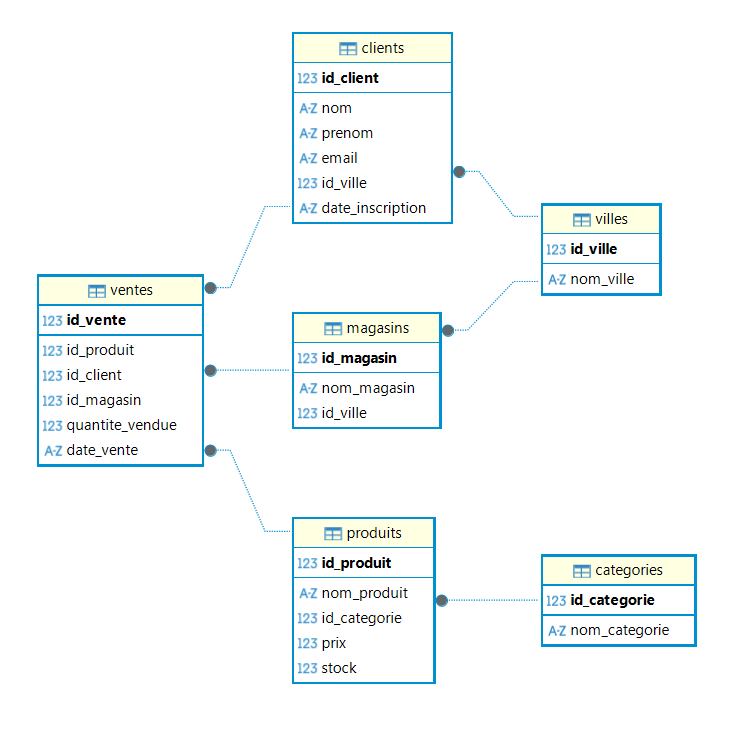

# Exercice sur les jointures et manipulation de la base de donnees du magasin de sport run and win

## Contexte

Le succès de **"Run & Win RDC"** apporte un nouveau problème : la masse de données devient ingérable sur Excel. Mr Jhon a reçu un rapport de ventes, mais il ne contient que des codes : "Le produit ID_45 a été vendu au magasin MAG_02".

Il est furieux : **"Je ne suis pas un robot, je ne connais pas ces codes par cœur !"**. Il veut voir des noms de produits, des catégories et des noms de villes. Mr Jhon a essayé de faire des **RECHERCHEV** pour lier les fichiers, mais son ordinateur a planté trois fois à cause du volume de données.

**Ta mission** : En tant que Data Analyst, tu dois prouver que le SQL est 100 fois plus puissant qu'Excel pour lier des tables. Tu vas construire des requêtes "Master" qui lie les **Ventes**, les **Produits** et les **Magasins** pour offrir à Mr Jhon un rapport limpide.

## MLD Magasin de sport run and win

## Objectifs pédagogiques

À la fin de cet exercice, tu seras capable de :

* **Lier plusieurs tables** : Maîtriser la syntaxe `INNER JOIN ... ON ...`.

* **Utiliser les Alias de table** : Rendre tes requêtes lisibles avec `FROM ventes AS v`.

* **Naviguer dans le schéma** : Savoir passer d'une table A à une table C via une table B (Clés étrangères).

* **Extraire de la valeur** : Transformer des IDs techniques en informations métier.

## Modalités pédagogiques

* **Méthode** : SQL Avancé (Jointures Multiples).

* **Durée** : 2 jours.

* **Outils** : DBeaver ou SQLite.

* **Collaboration** : Échangez sur le canal : "Quelle est la différence si je fais un LEFT JOIN au lieu d'un INNER JOIN ici ?".

## Travail à réaliser

Pour sauver les nerfs de Mr Jhon, il t'a laissé cette liste de rapports à générer. Pour chaque question, tu dois écrire la requête SQL (utilisant des INNER JOIN) dans ton fichier queries.sql.

**1. Le Rapport Lisible (La fin du RECHERCHEV)**

>"Je veux la liste de toutes les ventes, mais remplace les IDs par le **nom du produit** et le **nom de la ville du magasin**. Affiche aussi la date et la quantité."

* **Compétence testée** : Double `INNER JOIN` (3 tables liées).

**2. Le focus "Grand Kivu"**

>"On veut analyser les performances à l'Est. Donne-moi toutes les ventes (Nom produit, Prix, Quantité) réalisées uniquement dans les magasins de **Goma** et **Bukavu**."

* **Compétence testée** : `JOIN` + `WHERE` sur une colonne d'une table liée.

**3. Le top "Katanga"**

>"À **Lubumbashi**, quels sont les produits de la catégorie 'Running' que nous avons vendus ? Je veux le nom des produits et le total des quantités vendues."

* **Compétence testée** : Triple `JOIN` (avec la table catégories) + `SUM` + `GROUP BY`.

**4. La rentabilité par Magasin**

>"Mr Jhon veut savoir quel magasin a généré le plus de cash. Affiche le **Nom du magasin**, sa **Ville** et le **Chiffre d'Affaires total**."

* **Compétence testée** : `JOIN` + Calcul (`quantite * prix`) + `GROUP BY`.

**5. L'inventaire des catégories par Ville**

>"Est-ce qu'on vend du 'Yoga' à **Matadi** ? Liste les noms des catégories vendues par ville, sans doublons."

* **Compétence testée** : `DISTINCT` + Multi-Jointures.

## Astuces de Data Analyst

* **Le préfixe est ton ami** : Quand tu lies des tables, écris toujours `v.quantite` ou `p.nom_produit` pour que SQL sache de quelle table tu parles.

* **Le schéma d'abord** : Regarde toujours ton MLD avant d'écrire ton code. La "clé" est là.

* **La chaîne de jointure** : Si tu veux le nom de la catégorie d'un produit vendu, tu dois faire : `Ventes` ➔ `Produits` ➔ `Catégories`.

## Livrables

* **Le fichier SQL** : `queries.sql`.

* **Capture d'écran** : Le résultat des requêtes (Le rapport lisible).

* **Dépôt GitHub** : Dossier `sql-joins-run-and-win`.

Note pour la soumission :

Le lien vers le repos Github sur lequel vous allez retrouver le fichier de base sur lequel travailler et ensuite déposer votre travail :

Pour la classe 2026-janvier-da-soir-b

Pour la classe 2026-janvier-da-midi-c

Après avoir déposé votre travail sur Github, veuillez copier l'url du repos Github et finaliser votre soumission en le soumettant sur Canvas.

